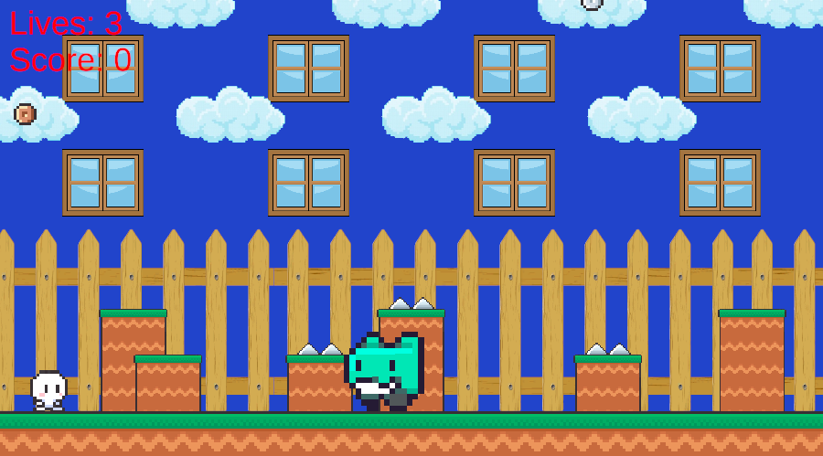
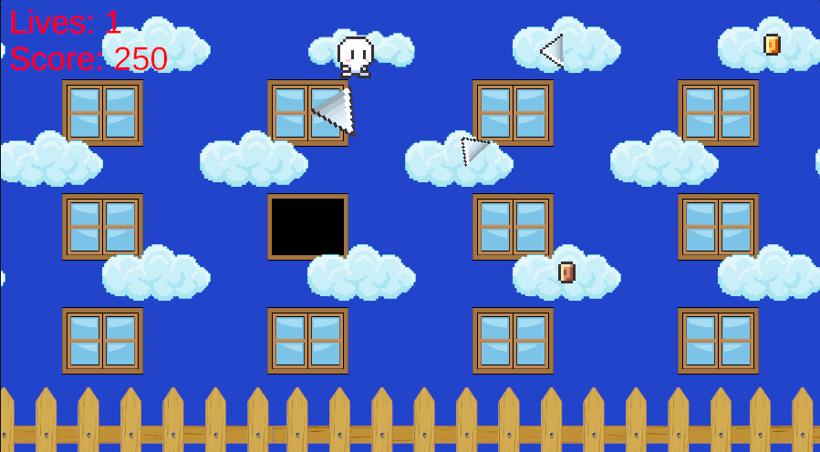

# AlleyCat Game

Реализация игры на Unity 2D, с механиками игры "Alley Cat" (1984 год).

[Игра на itch.io](https://gregtag.itch.io/alleygame)

## Описание
* При запуске игры игрок наблюдает персонажа, платформы с шипами, забор, окна, облака, монетки, врага. 
* Управление персонажем происходит при помощи W,A,S,D либо стрелочек.
* Игрок может запрыгивать на платформы и забор и спрыгивать с них. 
* Случайно на платформе появляются шипы и если на этой платформе находился игрок, то он падает вниз.
* Случайно время от времени появляется враг, который по нижнему уровню слева направо или справо налево и может убить персонажа.
* Если игрок умирает, то он возвращается на начало уровня и теряет одну жизнь.
* Игрок должен запрыгнуть сначала на низкую платформу, затем на высокую, потом на забор. После этого он может запрыгнуть в окно и выиграть игру.
* Когда игрок запрыгивает на забор, то случайно открывается одно из 12 окон. Из открытого окна могут лететь шипы по параболической траектории в сторону игрока, которые могут его убить.
* Игрок может зацепиться за облака и перемещаться по ним. На каждом из трёх слоёв облаков находится по монетке разной стоимости.
* Если игрок падает с облака, то он возвращается на начало уровня.
* Монетки случайным образом могут перемещаться по облакам внутри одного слоя и также случайно могут кидать шипы в сторону игрока, которые летят по прямой.
* Игрок может собирать монетки, набирая очки.
* В верхнем левом углу экрана отображаются жизни игрока, а также количество набранных очков. Если жизни заканчиваются, то игрок проигрывает.
